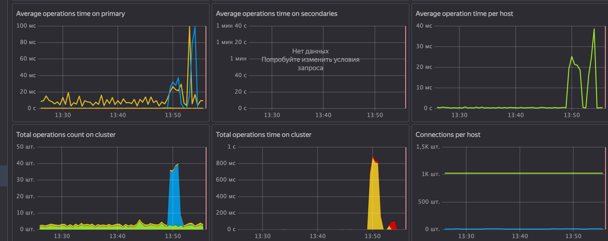

# mongo_otus

# ДЗ № 7

## В процессе сделано:

Создаем инстанс mongodb в yandex.cloud :

- Используем terraform для развертывния инстанса yacloud_mongo_terraform  :
```
yc managed-mongodb cluster list
+----------------------+---------+---------------------+--------+---------+
|          ID          |  NAME   |     CREATED AT      | HEALTH | STATUS  |
+----------------------+---------+---------------------+--------+---------+
| c9qd2ub2sff3ioufjho1 | mongodb | 2022-02-23 05:29:35 | ALIVE  | RUNNING |
+----------------------+---------+---------------------+--------+---------+
```

- Подключимся к инстансу:
```
sudo mkdir -p /usr/local/share/ca-certificates/Yandex && \
sudo wget "https://storage.yandexcloud.net/cloud-certs/CA.pem" -O /usr/local/share/ca-certificates/Yandex/YandexInternalRootCA.crt


mongo --norc \
        --tls \
        --tlsCAFile /usr/local/share/ca-certificates/Yandex/YandexInternalRootCA.crt \
        --host 'rs01/rc1c-emrcjlnzi7jtmevd.mdb.yandexcloud.net:27018' \
        -u mongo \
        -p password \
        stocks

MongoDB shell version v3.6.8
connecting to: mongodb://rc1c-emrcjlnzi7jtmevd.mdb.yandexcloud.net:27018/mongodb?replicaSet=rs01
2022-02-23T06:16:31.503+0000 I NETWORK  [thread1] Starting new replica set monitor for rs01/rc1c-emrcjlnzi7jtmevd.mdb.yandexcloud.net:27018
2022-02-23T06:16:31.510+0000 I NETWORK  [thread1] Successfully connected to rc1c-emrcjlnzi7jtmevd.mdb.yandexcloud.net:27018 (1 connections now open to rc1c-emrcjlnzi7jtmevd.mdb.yandexcloud.net:27018 with a 5 second timeout)
Implicit session: session { "id" : UUID("ee90ef57-62ed-4fcd-bac0-569b63af8b82") }
MongoDB server version: 4.4.10
WARNING: shell and server versions do not match
rs01:PRIMARY>
```
Зальем данные:
```
mongorestore --host 'rs01/rc1c-emrcjlnzi7jtmevd.mdb.yandexcloud.net' \
             --port 27018 \
             --ssl \
             --sslCAFile /usr/local/share/ca-certificates/Yandex/YandexInternalRootCA.crt \
             --username mongo \
             --password "password" \
             -j 5 \
             --authenticationDatabase stocks \
             --nsInclude '*.*' ~/dump

2022-02-23T06:49:19.198+0000	preparing collections to restore from
2022-02-23T06:49:19.200+0000	no metadata; falling back to system.indexes
2022-02-23T06:49:19.219+0000	restoring stocks.values from /home/ubuntu/dump/stocks/values.bson
2022-02-23T06:49:22.180+0000	[........................]  stocks.values  27.4MB/715MB  (3.8%)
2022-02-23T06:49:25.181+0000	[#.......................]  stocks.values  48.6MB/715MB  (6.8%)
2022-02-23T06:49:28.181+0000	[#.......................]  stocks.values  58.6MB/715MB  (8.2%)
2022-02-23T06:49:31.180+0000	[##......................]  stocks.values  84.9MB/715MB  (11.9%)
2022-02-23T06:49:34.180+0000	[###.....................]  stocks.values  91.7MB/715MB  (12.8%)
2022-02-23T06:49:37.181+0000	[####....................]  stocks.values  119MB/715MB  (16.7%)
2022-02-23T06:49:40.181+0000	[####....................]  stocks.values  128MB/715MB  (17.9%)
2022-02-23T06:49:43.181+0000	[####....................]  stocks.values  148MB/715MB  (20.6%)
2022-02-23T06:49:46.181+0000	[#####...................]  stocks.values  164MB/715MB  (22.9%)
2022-02-23T06:49:49.181+0000	[######..................]  stocks.values  185MB/715MB  (25.8%)
2022-02-23T06:49:52.181+0000	[######..................]  stocks.values  201MB/715MB  (28.2%)
2022-02-23T06:49:55.180+0000	[#######.................]  stocks.values  219MB/715MB  (30.6%)
2022-02-23T06:49:58.181+0000	[########................]  stocks.values  243MB/715MB  (33.9%)
2022-02-23T06:50:01.181+0000	[########................]  stocks.values  250MB/715MB  (34.9%)
2022-02-23T06:50:04.181+0000	[#########...............]  stocks.values  272MB/715MB  (38.1%)
2022-02-23T06:50:07.181+0000	[#########...............]  stocks.values  286MB/715MB  (40.0%)
2022-02-23T06:50:10.180+0000	[##########..............]  stocks.values  305MB/715MB  (42.7%)
2022-02-23T06:50:13.181+0000	[##########..............]  stocks.values  323MB/715MB  (45.2%)
2022-02-23T06:50:16.180+0000	[###########.............]  stocks.values  334MB/715MB  (46.7%)
2022-02-23T06:50:19.181+0000	[###########.............]  stocks.values  357MB/715MB  (49.9%)
2022-02-23T06:50:22.180+0000	[############............]  stocks.values  372MB/715MB  (52.0%)
2022-02-23T06:50:25.180+0000	[#############...........]  stocks.values  398MB/715MB  (55.7%)
2022-02-23T06:50:28.181+0000	[#############...........]  stocks.values  406MB/715MB  (56.7%)
2022-02-23T06:50:31.181+0000	[##############..........]  stocks.values  433MB/715MB  (60.5%)
2022-02-23T06:50:34.181+0000	[##############..........]  stocks.values  444MB/715MB  (62.0%)
2022-02-23T06:50:37.180+0000	[###############.........]  stocks.values  459MB/715MB  (64.1%)
2022-02-23T06:50:40.180+0000	[################........]  stocks.values  479MB/715MB  (66.9%)
2022-02-23T06:50:43.180+0000	[################........]  stocks.values  488MB/715MB  (68.2%)
2022-02-23T06:50:46.180+0000	[#################.......]  stocks.values  514MB/715MB  (71.8%)
2022-02-23T06:50:49.181+0000	[#################.......]  stocks.values  523MB/715MB  (73.1%)
2022-02-23T06:50:52.180+0000	[##################......]  stocks.values  543MB/715MB  (75.9%)
2022-02-23T06:50:55.181+0000	[##################......]  stocks.values  565MB/715MB  (79.0%)
2022-02-23T06:50:58.180+0000	[###################.....]  stocks.values  577MB/715MB  (80.6%)
2022-02-23T06:51:01.181+0000	[####################....]  stocks.values  599MB/715MB  (83.7%)
2022-02-23T06:51:04.181+0000	[####################....]  stocks.values  610MB/715MB  (85.3%)
2022-02-23T06:51:07.180+0000	[#####################...]  stocks.values  639MB/715MB  (89.4%)
2022-02-23T06:51:10.181+0000	[#####################...]  stocks.values  645MB/715MB  (90.2%)
2022-02-23T06:51:13.181+0000	[######################..]  stocks.values  672MB/715MB  (94.0%)
2022-02-23T06:51:16.181+0000	[#######################.]  stocks.values  691MB/715MB  (96.6%)
2022-02-23T06:51:19.180+0000	[#######################.]  stocks.values  704MB/715MB  (98.4%)
2022-02-23T06:51:20.606+0000	[########################]  stocks.values  715MB/715MB  (100.0%)
2022-02-23T06:51:20.606+0000	restoring indexes for collection stocks.values from metadata
2022-02-23T06:51:20.607+0000	finished restoring stocks.values (4308303 documents)
2022-02-23T06:51:20.607+0000	done
```
Неплохая скорость загрузки -700мб за 2 минуты.
Поселектим данные :
```
rs01:PRIMARY> db.values.aggregate( [
...       { $sort : { "open": -1, "exchange": 1 } },
...       { $limit : 3 }
...    ],
...    { allowDiskUse: true })
{ "_id" : ObjectId("4d094f61c96767d7a014b3c9"), "exchange" : "NASDAQ", "stock_symbol" : "ATCO", "date" : "2000-03-16", "open" : 31007, "high" : 9.38, "low" : 9.38, "close" : 9.38, "volume" : 900, "adj close" : 9.38 }
{ "_id" : ObjectId("4d094f62c96767d7a0163bbe"), "exchange" : "NASDAQ", "stock_symbol" : "AWRE", "date" : "2000-06-06", "open" : 29595, "high" : 51.5, "low" : 55, "close" : 51.25, "volume" : 5500, "adj close" : 51.25 }
{ "_id" : ObjectId("4d095008c96767d7a044baef"), "exchange" : "NASDAQ", "stock_symbol" : "FSCI", "date" : "2000-05-18", "open" : 15713, "high" : 74.5, "low" : 74.5, "close" : 70, "volume" : 7000, "adj close" : 67.85 }

rs01:PRIMARY> db.values.distinct("stock_symbol").length
1618
```
Все работает шустро 
