# mongo_otus

# Проект - "Автоматизированное развертывание отказоустойчивого сайта системы бронирования кинотеатра в kubernetes на go и mongo"
## Архитектура проекта:
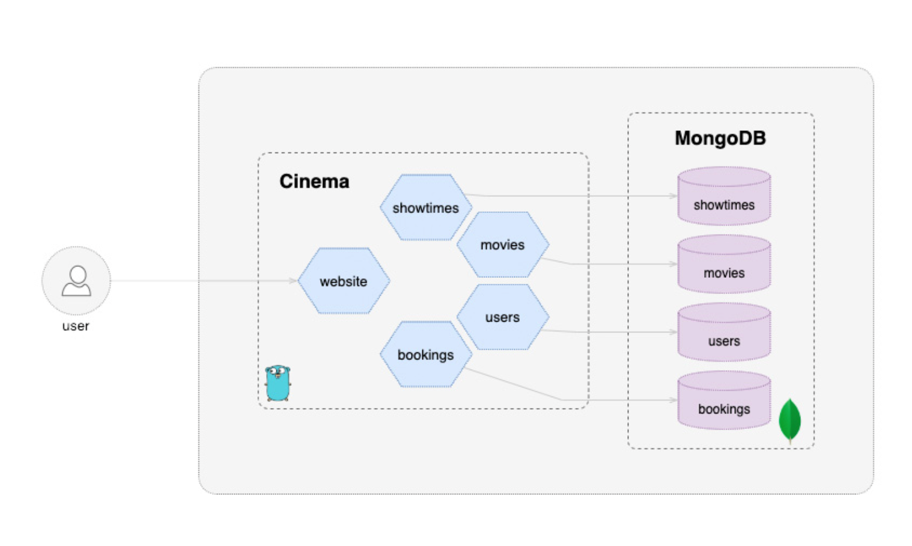

Проект кинотеатра является примером ,демонстрирующим  использование  микросервисной архитектуры для реализации  функционала кинотеатра. Бэкенд  использует  5 микросервисов,написанных на  go и использующих mongodb для хранения данных:

* Website service : front;
* Movie service : информация  о фильмах;
* Showtimes service : информация о времени сеансов;
* Booking Service :  инофрмация о бронировании;
* Users service:  рекомендации для пользователей.

## Описание Инфрастуктуры проекта:

### Используется terraform  для развертывания 3-х нодного кластера  gke;
### Используется  helm/helmfile.yaml  для  развертывания инфрастуктурных модулей :
* стэк prometheus для мониторинга и exporter для mongo:

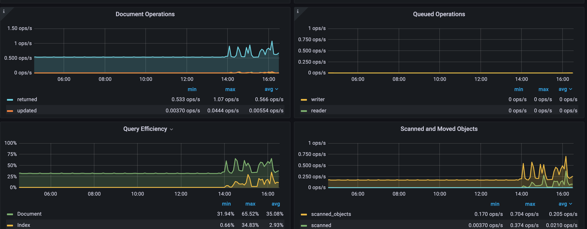

* nginx-ingress и  cert-manager  для front website с ssl, используется 3 контроллера на каждой ноде для отказоустойчивости:

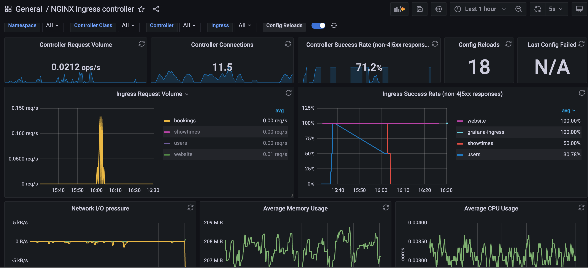

*  helm chart bitnami для 3-х нодного кластера mongo:
1)  ноды распределяются по независимым узлам кластера;
2)  используется sidecar container для вычисления master node  и динамического проставления label на нее,таким образом service всегда будет подключен к master node;
3) в каталоге backup лежит дамп создания бд для сервисов,пример развертывания:
```
mongorestore --host 34.88.103.244:30001 -u mongo -p password -d  --gzip  backup/cinema
use admin;
```
 создадим user для сервисов:
 ```
db.createUser( { user: "cinema", pwd: "cinema1", roles: [ "userAdminAnyDatabase", "dbAdminAnyDatabase", "readWriteAnyDatabase" ] } )
```
4) После развертывания ingress необходимо  получить переменную внешнего ip адреса:
```
export nginx_ingress_ip=$(kubectl get svc --namespace=ingress-nginx ingress-nginx-controller -o jsonpath='{.status.loadBalancer.ingress[0].ip}')
```

### Используется  helm/cinema/helmfile.yaml apply  для  развертывания бизнес модулей :
1) развертываются 5 deployment;
2) создается ingress для сервисов front и api (адрес берется из переменной nginx_ingress_ip):

website - https://cinema.34.88.90.174.nip.io;

bookings - https://cinema.34.88.90.174.nip.io/api/bookings;

movies - https://cinema.34.88.90.174.nip.io/api/movies;

showtimes - https://cinema.34.88.90.174.nip.io/api/showtimes;

users - https://cinema.34.88.90.174.nip.io/api/users

Добавим напрямую через  бд новых  пользователей:
```
db.users.insert([
    {"name":"Bob","lastname":"Spunch"},
     {"name":"Patrick","lastname":"Wilson"}])
```
Проверим что данные отобразятся на сайте :
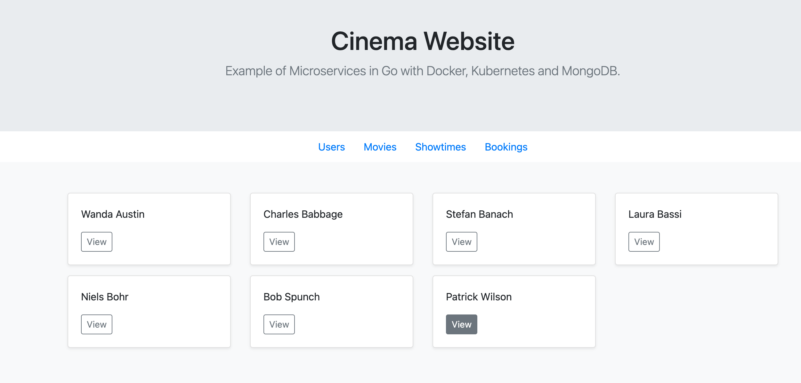

Добавим также  новые фильмы:
```
db.movies.insert([
{ "title" : "The Batman", "director" : "Matt Reeves", "rating" : 4.099999904632568 },
{ "title" : "Uncharted", "director" : "Ruben Fleischer", "rating" : 4.099999904632568 }])
```
Проверим что данные отобразятся на сайте :
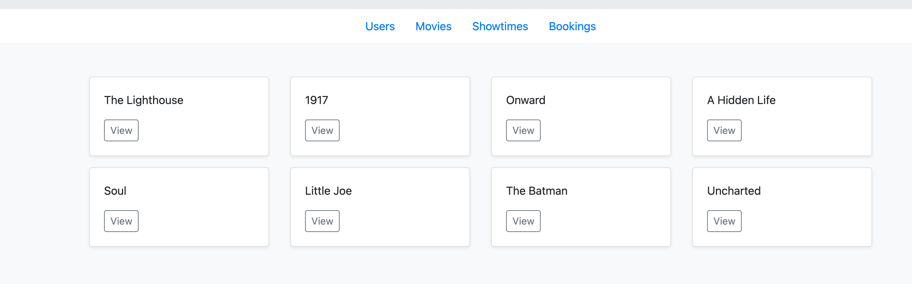

### API Endpoints
Нам доступны api для манипуляций с данными:

#### User Service

This service returns information about the users of Cinema.

| Service | Method | Endpoint       |
|---------|--------|----------------|
| List users | `GET` | `/api/users/` |
| Get user by Id | `GET` | `/api/users/{id}` |
| Insert user | `POST` | `/api/users/` |
| Delete user | `DELETE` | `/api/users/{id}` |

#### Movie Service

This service is used to get information about a movie. It provides the movie title, rating on a 1-5 scale, director and other information.

| Service | Method | Endpoint       |
|---------|--------|----------------|
| List movies | `GET` | `/api/movies/` |
| Get movie by Id | `GET` | `/api/movies/{id}` |
| Insert movie | `POST` | `/api/movies/` |
| Delete movie | `DELETE` | `/api/movies/{id}` |

#### Showtimes Service

This service is used get a information about showtimes playing on a certain date.

| Service | Method | Endpoint       |
|---------|--------|----------------|
| List showtimes | `GET` | `/api/showtimes/` |
| Get showtime by Id | `GET` | `/api/showtimes/{id}` |
| Get showtime by date | `GET` | `/api/showtimes/filter/date/{date}` |
| Insert showtime | `POST` | `/api/showtimes/` |
| Delete showtime | `DELETE` | `/api/showtimes/{id}` |

#### Booking Service

Used to lookup booking information for users.

| Service | Method | Endpoint       |
|---------|--------|----------------|
| List bookings | `GET` | `/api/bookings/` |
| Get booking by Id | `GET` | `/api/bookings/{id}` |
| Insert booking | `POST` | `/api/bookings/` |
| Delete booking | `DELETE` | `/api/bookings/{id}` |

Запросим данные о пользователях через api:
```
wget https://cinema.34.88.90.174.nip.io/api/users/
```
Для визуализации используется https://web.postman.co/
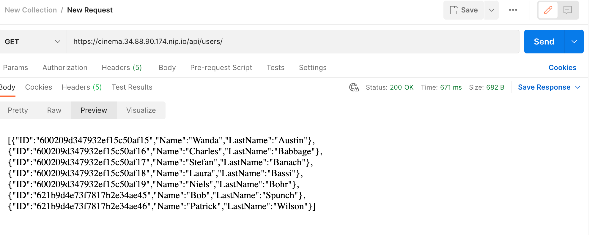

Добавим информацию о новом пользователе через API :

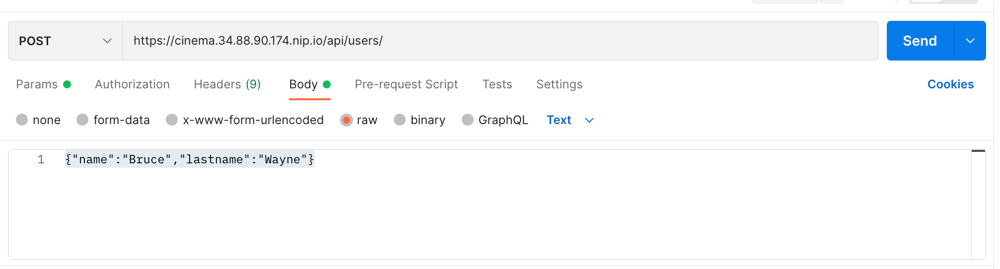

Проверим что он появился на сайте:

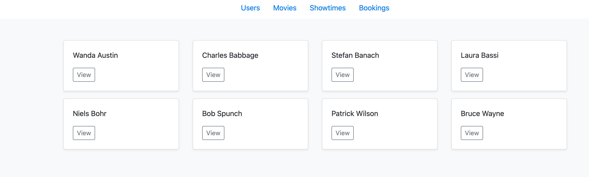

Добавим новый сеанс фильма BATMAN первого марта через БД  и забронируем билет для BRUCE WAYNE :

```
db.showtimes.insert([
{ "date" : "2022-03-01","created_at" : ISODate("2022-03-01T00:28:34.502Z"), "movies" :[ "621dcc031fe8ee9d51ba4e39","6002130f0f646161d37f7960", "6002130f0f646161d37f7961"]}])
```
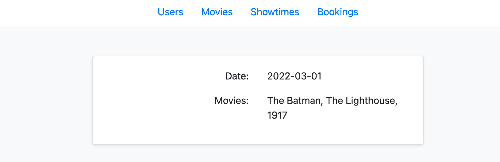

db.bookings.insert([
{"userid" : "621ddb2a7070895a52b6d8d8","showtimeid" : "621ddf50c46476d821139c3c", "movies" : [ "621dcc031fe8ee9d51ba4e39" ] }])

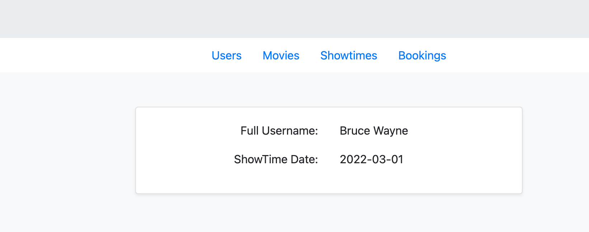

## Испытания отказоустойчивости
Посмотрим как система отказоустойчива,отключим первую ноду:
```
kubectl get nodes -o wide
NAME                                                  STATUS   ROLES    AGE   VERSION           INTERNAL-IP   EXTERNAL-IP      OS-IMAGE                             KERNEL-VERSION   CONTAINER-RUNTIME
gke-otus-mongodb-otus-mongodb-node-po-093e96cf-6s73   Ready    <none>   3d    v1.21.9-gke.300   10.10.0.4     34.88.103.244    Container-Optimized OS from Google   5.4.170+         containerd://1.4.8
gke-otus-mongodb-otus-mongodb-node-po-093e96cf-7c2b   Ready    <none>   3d    v1.21.9-gke.300   10.10.0.3     35.228.104.0     Container-Optimized OS from Google   5.4.170+         containerd://1.4.8
gke-otus-mongodb-otus-mongodb-node-po-093e96cf-rcr5   Ready    <none>   3d    v1.21.9-gke.300   10.10.0.5     35.228.188.229   Container-Optimized OS from Google   5.4.170+         containerd://1.4.8

kubectl taint node gke-otus-mongodb-otus-mongodb-node-po-093e96cf-rcr5 node-role=infra:NoSchedule

kubectl delete pod mongodb-0 -n mongo

kubectl get pods -n mongo -o wide
NAME        READY   STATUS    RESTARTS   AGE   IP            NODE                                                  NOMINATED NODE   READINESS GATES
mongodb-0   0/3     Pending   0          22s   <none>        <none>                                                <none>           <none>
mongodb-1   3/3     Running   0          43h   10.116.1.61   gke-otus-mongodb-otus-mongodb-node-po-093e96cf-6s73   <none>           <none>
mongodb-2   3/3     Running   0          43h   10.116.0.51   gke-otus-mongodb-otus-mongodb-node-po-093e96cf-7c2b   <none>           <none>

```
Подключимся к mongo через сервис который балансирует всегда на primary и проверим что она доступна:
```
kubectl get endpoints
-n mongo
NAME               ENDPOINTS                             AGE
mongodb-headless   10.116.0.51:27017,10.116.1.61:27017   3d
mongodb-metrics    10.116.0.51:9216,10.116.1.61:9216     3d
mongodb-primary    10.116.1.61:27017                     3d
```
service mongodb в endpoint указывает что mongodb-primary это 10.116.1.61 -данный ip является адресом второго pod - mongodb1
```
rs0:PRIMARY> rs.status()
{
	"set" : "rs0",
	"date" : ISODate("2022-03-01T09:55:58.776Z"),
	"myState" : 1,
	"term" : NumberLong(7),
	"syncSourceHost" : "",
	"syncSourceId" : -1,
	"heartbeatIntervalMillis" : NumberLong(2000),
	"majorityVoteCount" : 2,
	"writeMajorityCount" : 2,
	"votingMembersCount" : 3,
	"writableVotingMembersCount" : 3,
	"optimes" : {
		"lastCommittedOpTime" : {
			"ts" : Timestamp(1646128552, 2),
			"t" : NumberLong(7)
		},
		"lastCommittedWallTime" : ISODate("2022-03-01T09:55:52.860Z"),
		"readConcernMajorityOpTime" : {
			"ts" : Timestamp(1646128552, 2),
			"t" : NumberLong(7)
		},
		"readConcernMajorityWallTime" : ISODate("2022-03-01T09:55:52.860Z"),
		"appliedOpTime" : {
			"ts" : Timestamp(1646128552, 2),
			"t" : NumberLong(7)
		},
		"durableOpTime" : {
			"ts" : Timestamp(1646128552, 2),
			"t" : NumberLong(7)
		},
		"lastAppliedWallTime" : ISODate("2022-03-01T09:55:52.860Z"),
		"lastDurableWallTime" : ISODate("2022-03-01T09:55:52.860Z")
	},
	"lastStableRecoveryTimestamp" : Timestamp(1646128540, 1),
	"electionCandidateMetrics" : {
		"lastElectionReason" : "stepUpRequestSkipDryRun",
		"lastElectionDate" : ISODate("2022-03-01T09:55:00.050Z"),
		"electionTerm" : NumberLong(7),
		"lastCommittedOpTimeAtElection" : {
			"ts" : Timestamp(1646128491, 1),
			"t" : NumberLong(6)
		},
		"lastSeenOpTimeAtElection" : {
			"ts" : Timestamp(1646128491, 1),
			"t" : NumberLong(6)
		},
		"numVotesNeeded" : 2,
		"priorityAtElection" : 1,
		"electionTimeoutMillis" : NumberLong(10000),
		"priorPrimaryMemberId" : 0,
		"numCatchUpOps" : NumberLong(0),
		"newTermStartDate" : ISODate("2022-03-01T09:55:00.109Z"),
		"wMajorityWriteAvailabilityDate" : ISODate("2022-03-01T09:55:00.229Z")
	},
	"electionParticipantMetrics" : {
		"votedForCandidate" : true,
		"electionTerm" : NumberLong(6),
		"lastVoteDate" : ISODate("2022-03-01T09:39:31.883Z"),
		"electionCandidateMemberId" : 0,
		"voteReason" : "",
		"lastAppliedOpTimeAtElection" : {
			"ts" : Timestamp(1646127565, 1),
			"t" : NumberLong(5)
		},
		"maxAppliedOpTimeInSet" : {
			"ts" : Timestamp(1646127565, 1),
			"t" : NumberLong(5)
		},
		"priorityAtElection" : 1
	},
	"members" : [
		{
			"_id" : 0,
			"name" : "mongodb-0.mongodb-headless.mongo.svc.cluster.local:27017",
		
			"lastHeartbeatMessage" : "Error connecting to mongodb-0.mongodb-headless.mongo.svc.cluster.local:27017 :: caused by :: Could not find address for mongodb-0.mongodb-headless.mongo.svc.cluster.local:27017: SocketException: Host not found (authoritative)",
			"syncSourceHost" : "",
			"syncSourceId" : -1,
			"infoMessage" : "",
			"configVersion" : 7,
			"configTerm" : 6
		},
		{
			"_id" : 1,
			"name" : "mongodb-1.mongodb-headless.mongo.svc.cluster.local:27017",

		{
			"_id" : 2,
			"name" : "mongodb-2.mongodb-headless.mongo.svc.cluster.local:27017",

	],
	"ok" : 1,
	"$clusterTime" : {
		"clusterTime" : Timestamp(1646128552, 2),
		"signature" : {
			"hash" : BinData(0,"QrAjCDga93o8Jqkcqd8rRR/raV4="),
			"keyId" : NumberLong("7068949061734236162")
		}
	},
	"operationTime" : Timestamp(1646128552, 2)
}
rs0:PRIMARY> db.users.find();
{ "_id" : ObjectId("600209d347932ef15c50af15"), "name" : "Wanda", "lastname" : "Austin" }
{ "_id" : ObjectId("600209d347932ef15c50af19"), "name" : "Niels", "lastname" : "Bohr" }
{ "_id" : ObjectId("600209d347932ef15c50af17"), "name" : "Stefan", "lastname" : "Banach" }
{ "_id" : ObjectId("600209d347932ef15c50af18"), "name" : "Laura", "lastname" : "Bassi" }
{ "_id" : ObjectId("600209d347932ef15c50af16"), "name" : "Charles", "lastname" : "Babbage" }
{ "_id" : ObjectId("621b9d4e73f7817b2e34ae45"), "name" : "Bob", "lastname" : "Spunch" }
{ "_id" : ObjectId("621b9d4e73f7817b2e34ae46"), "name" : "Patrick", "lastname" : "Wilson" }
{ "_id" : ObjectId("621ddb2a7070895a52b6d8d8"), "name" : "Bruce", "lastname" : "Wayne" }
```
Как мы видим нода недоступна но кластер полностью работоспособен,как и website благодаря распределению ingress controller по нодам :

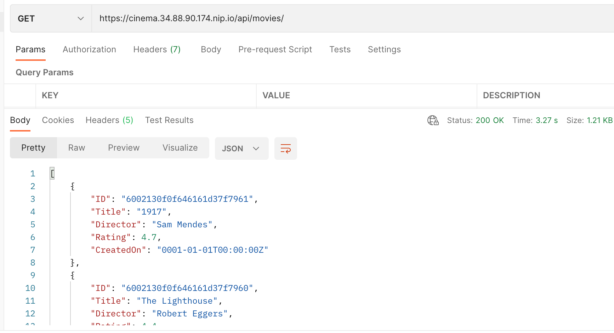